[简体中文](README.md) | [English](README.en-US.md)

# LLM Client for WPF

A large language model (LLM) client project implemented based on `.NET` and `WPF` technology, aiming to provide a lightweight, intuitive, and feature-rich interaction tool to use various supported LLM services. The project natively supports some models provided under the GitHub Copilot service (such as `GPT-4o`, `O1`, and `DeepSeek`), and can be extended to support other service endpoints.

## Pure .NET WPF Implementation
   I want to prove that it is feasible to build a usable, modern LLM client entirely with .NET and classic WPF👍. Most current implementations are based on python+ts😢.
   - Utilize `MaterialDesignThemes` for modern interface design.
   - Use `Microsoft.Extensions.AI` for integration with large language model APIs.
   - Use `Markdig.Wpf` for Markdown parsing.
   - Utilize `Microsoft.SemanticKernel` for core large model dialogue and RAG capabilities.
   - Use `ig` for reading and parsing PDF documents.
   - Implement `ModelContextProtocol` for MCP protocol support.
   - Utilize `TextMateSharp` for syntax highlighting.
   ---
## Basic Session Features
   **Endpoint-Model Configuration**
   Configuration is divided by endpoint, and users can add multiple endpoints and different models for each endpoint.
   The GitHub Copilot endpoint is preset, and users only need to provide a token to use it.
   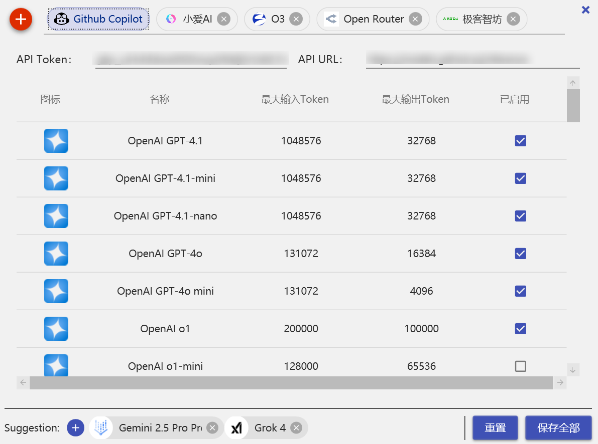
   It also allows custom OpenAI API compatible endpoints. Here I added four API Endpoints:
   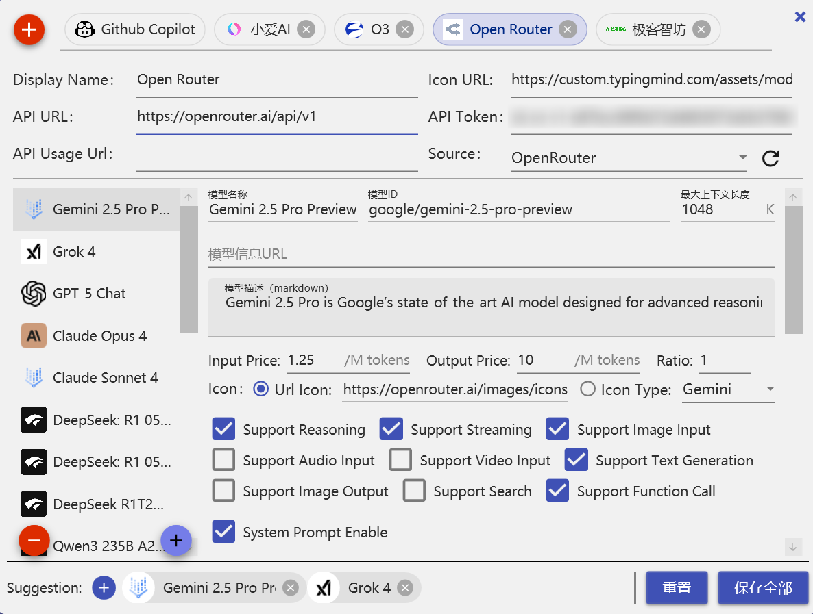
   The above is the largest model supplier [openrouter](https://openrouter.com). You can see that besides manually configuring models, you can also fill in the model id and retrieve model-related information from openrouter, making it convenient for users.
   **Create a Dialogue**
   Select 'New Dialogue' in the bottom left corner, choose an endpoint and a model, and enter a question to start a dialogue. 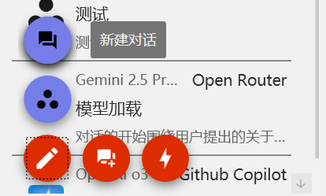
   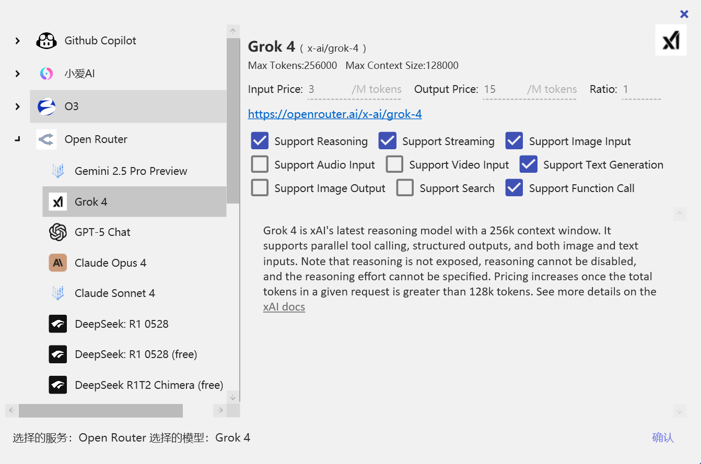
   Each model has its characteristics, and different characteristics come with different functions, such as supporting streaming output and function calls. These characteristics also influence the availability of dialogue functionalities.
   **Dialogue Interface**
   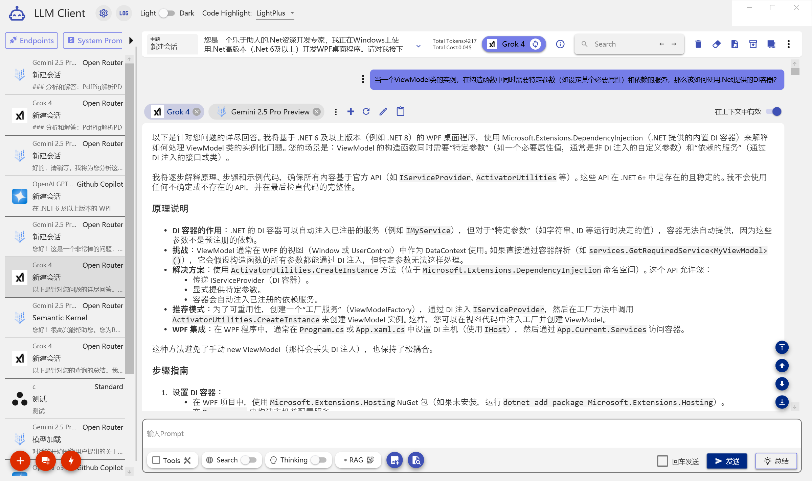
   - Fine dialogue context management, users can clear history, isolate history, and exclude individual replies. Unlike those tools that automatically manage context, users completely control context transmission.
   - Supports message type differentiation (e.g., user messages, model replies, system messages, etc.).
   - Saving and loading dialogue records for long-term use and management is supported.
   - Resending messages is possible.
   - Messages can be compared, fully supporting context like function calls.
   - Model switching and model parameter adjustments are allowed.
   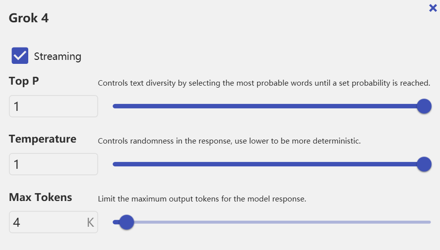
   - The dialogue is searchable and highlighted in yellow, allowing quick navigation to search results.
   - Markdown rendering and code highlighting are supported.
   - Dialogues can be exported to Markdown format for easier archiving and sharing.
   - Supports cloning dialogues.
   - Supports backup and import of dialogues.
   - Supports UI virtualization of dialogue records to enhance performance.
   - Theme switching (dark mode and light mode) is supported.

   - Supports code highlighting theme switching.
   **Dialogue Features**
   - Parameter changes and model switching.
   - Supports message resending.
   - Supports message comparison.
   - Supports corpus search and manual context addition.
   - Supports streaming output.
   - Supports function calling (including MCP).
   - Supports image input (images can be pasted directly into the input box).
   - Supports RAG function (corpus functionality is encapsulated as a function to maximize the flexibility of large models).
   - Supports search parameters (additional parameters are available for different API suppliers, such as OpenRouter).
   - Supports search tools (Function Call).
   - Supports Thinking switch (OpenRouter).
----

## Fine-grained RAG
Retrieval-Augmented Generation refers to enhancing the response capabilities of generative models by retrieving relevant information. In this project, the RAG feature allows users to combine external knowledge bases (e.g., documents, websites) with large language models to provide more accurate and contextually relevant responses. Unlike ordinary RAG, this project's RAG features have three significant characteristics:
1. **Fine-grained Document Import**: It is known that the bottleneck of RAG lies in document preprocessing, during which much information may be lost. This project supports importing multiple file formats (such as PDF, Word, text files, etc.), providing fine-grained chunking and embedding options to ensure maximum preservation of document content integrity.
2. **Function Call Integration**: The RAG feature is encapsulated as a function call, not limited to Query, but also extends to document structure queries, allowing LLM to generate Query strings based on understanding the document's overview. This fully utilizes the inferencing capability of large models, dynamically deciding when to invoke RAG functionality, thereby improving response relevance and accuracy.
3. **Structured Query**: Files will not be directly split into flat chunks but parsed into structured data (e.g., chapters, paragraphs, etc.), with each node automatically generating a Summary to support more complex query strategies. The query process will selectively execute top-down or bottom-up retrieval strategies based on the structure's characteristics. The query results are also returned in a structured format, making it easier for large models to understand and use. For instance, a returned paragraph will include its chapter information, facilitating the model's contextual understanding.

**File Import**
Users can import files through the UI interface, supporting multiple formats (currently supporting only PDF, Markdown). The file management page is as follows:

After selecting a file, use the toggle button on the right  to start the import process. Generally speaking, RAG encounters information loss at the first step of **file structuring**. To achieve high control over the RAG process, the file import process provides additional controls. For example, with the following PDF, you can select Margin in the interface, preview, and change the Bookmark (some PDFs have incorrect Bookmark markings).
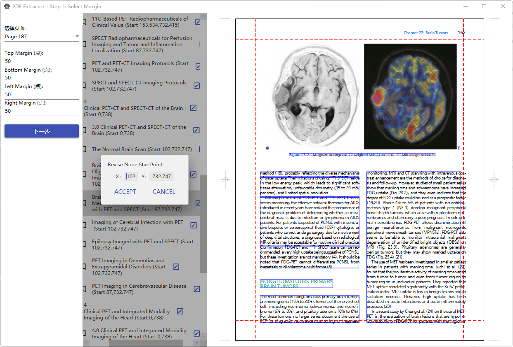
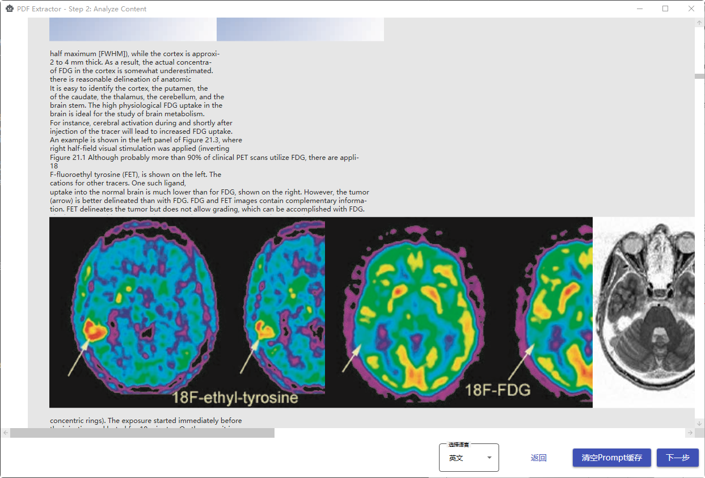
The above image shows nodes divided according to Bookmarks; the next step generates Summaries, and finally, the file is embedded and stored in a vector database (local Sqlite). We can preview them in the end:
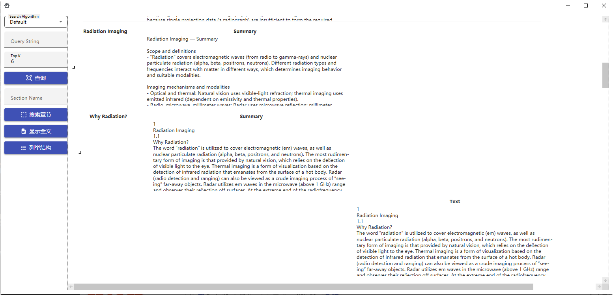
As shown above, the data is displayed in a tree structure, showing the Summary for Bookmark nodes and the actual content for Paragraph/Page nodes.
If building fails, you can view the reason in the log:
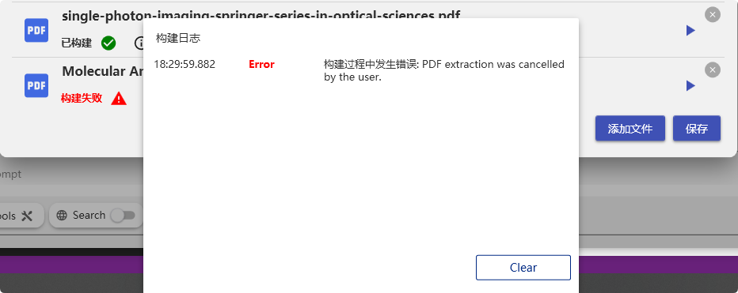
## MCP Support
-  Supports adding tools via UI and Json 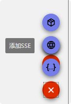
-  Json method formats are similar to tools like Claude Code
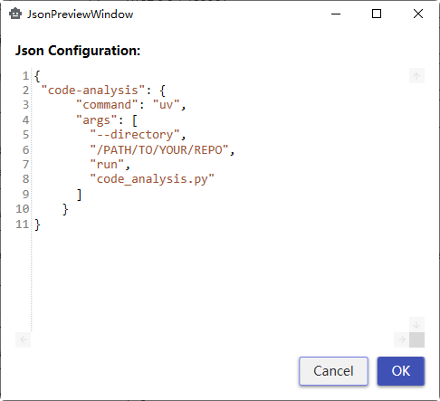
- After adding, you can manually refresh to obtain the tool list
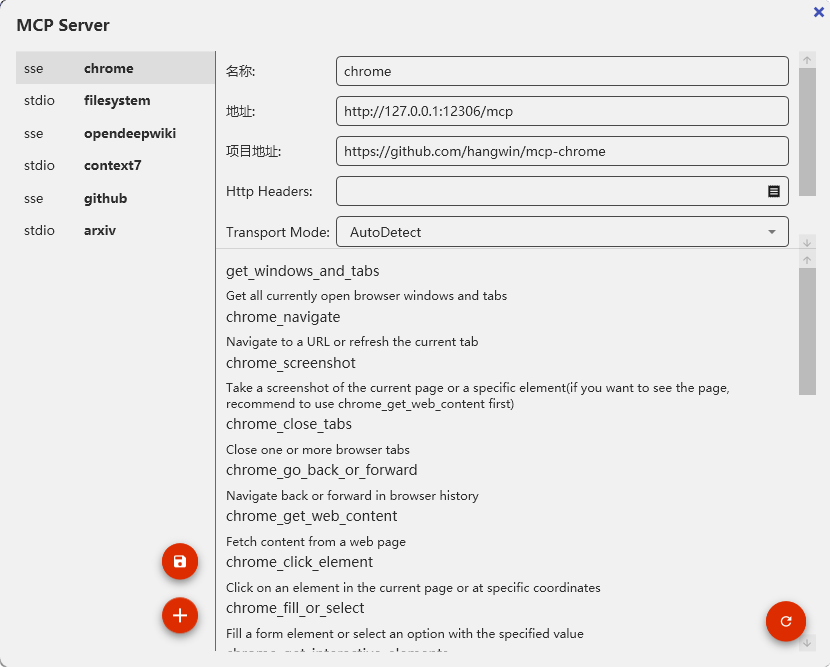
- MCP tools can also attach a prompt, which automatically attaches to the System Prompt when selecting that tool

## Project (Experimental)
The project feature allows users to create and manage multiple related dialogues that share the same context. This is suitable for scenarios requiring collaboration across multiple dialogues or tracking different topics. Each project can contain multiple dialogues and can be conveniently switched and managed between them.
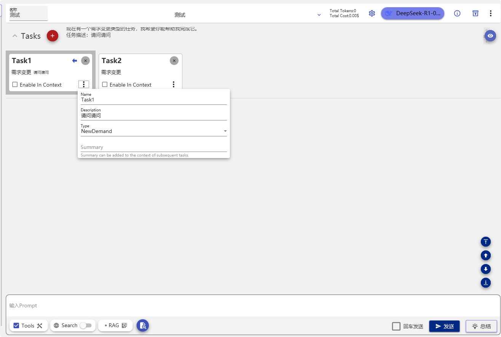

## Features in Progress

The following features are under development:

1. **Predefined CoT Orchestration**
   - Support orchestration based on the Chain-of-Thought (CoT) reasoning process, helping users efficiently obtain multi-step reasoning outputs.

2. **Auto-CoT**
   - Automatically generate Chain-of-Thought reasoning to enhance automated processing outcomes for complex tasks.

3. **Automatic Context Management**
   - Provides intelligent context management features, eliminating the need to manually exclude historical records.
## How to Contribute to the Project

As the project is still under development, you can contribute in the following ways:

1. Submit an Issue or PR: Any feedback on features, bug fixes, or suggestions for new features is highly welcomed!
2. Become a Contributor: Directly fork the project and initiate a Pull Request.
3. Contact the Author: For any questions or collaboration interests, you can contact me through [GitHub Issues](https://github.com/).

---

This is a learning project, and I appreciate your valuable feedback!