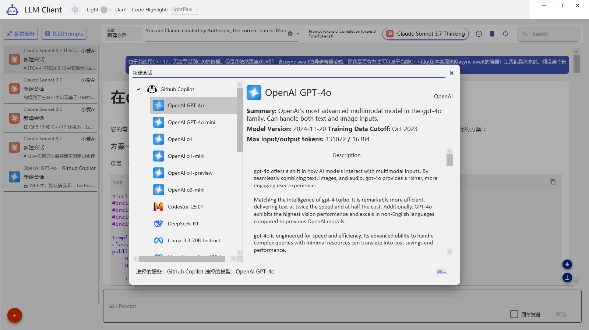
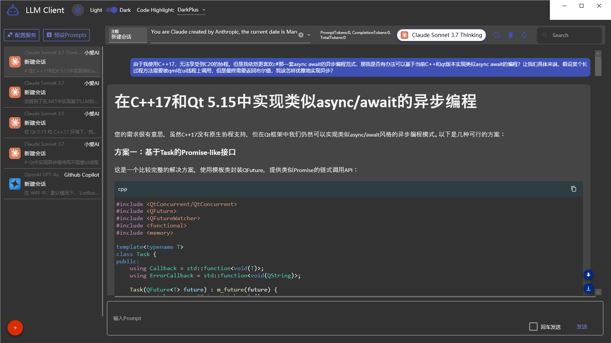

[English](README.md) | [简体中文](README.zh-CN.md)

# LLM Client for WPF

A lightweight, open-source large language model (LLM) client built with `.NET` and `WPF`. This project provides an intuitive and feature-rich interaction tool for utilizing various LLM services. By default, it supports some GitHub Copilot service models (e.g., `GPT-4o`, `O1`, and `DeepSeek`), with planned extensions for other endpoints.

## Key Features

1. **Pure .NET WPF Implementation**
   - Built with the `MaterialDesign` library for a modern UI.
   - Uses `Microsoft.Extensions.AI` for seamless LLM API integration.

2. **Basic LLM Interaction**
   - Configure and interact with language models.

3. **Code Highlighting**
   - Integrated `TextmateSharp` for syntax highlighting in various programming languages.

4. **Context Management**
   - Manually manage chat context by excluding specific conversation entries without deleting them.

5. **Theme Switching**
   - Supports light and dark themes for UI.
   - Allows switching between different code highlighting themes.

6. **UI Performance Optimization**
   - Conversation records implement UI virtualization for improved performance with large data sets.

7. **Markdown Export**
   - Save chat history in Markdown format for sharing or archiving.

## Project Screenshots

## Planned Features

The following features are under active development:

1. **Multi-Endpoint Support**
   - Add support for other LLM endpoints, such as `Claude`.

2. **Chain-of-Thought (CoT) Presets**
   - Enable users to orchestrate predefined Chain-of-Thought (CoT) workflows for multi-step reasoning.

3. **Auto-CoT**
   - Automatically generate Chain-of-Thought processes for better handling of complex tasks.

4. **RAG Integration**
   - Introduce Retrieval-Augmented Generation (RAG) for advanced knowledge-driven generation.

5. **Automatic Context Management**
   - Offer intelligent context management, eliminating the need for manual exclusions.

6. **Multi-Model Output Comparison**
   - Compare outputs from different LLMs for better model evaluation.

7. **Searching Functionality**
   - Quickly search through chat history and knowledge base content.

## How to Get Involved

This project is still in active development. You can contribute in the following ways:

1. **Submit Issues or Pull Requests**: All bug reports, feature requests, or suggestions are welcome!
2. **Become a Contributor**: Fork this repository and submit your changes through Pull Requests.
3. **Contact the Author**: Reach out via [GitHub Issues](https://github.com/) for questions or collaboration opportunities.

## Usage Instructions

> Detailed instructions on how to compile, run, and configure the project will be added.

## Acknowledgements

Special thanks to the following open-source libraries and tools:

- [MaterialDesignInXAML](https://github.com/MaterialDesignInXAML/MaterialDesignInXamlToolkit)
- [TextmateSharp](https://github.com/microsoft/TextMateSharp)
- [Microsoft.Extensions.AI](https://learn.microsoft.com/en-us/dotnet/)
- And other great tools and frameworks not listed here.

---

This is a project full of potential. Contributions are warmly welcomed!
