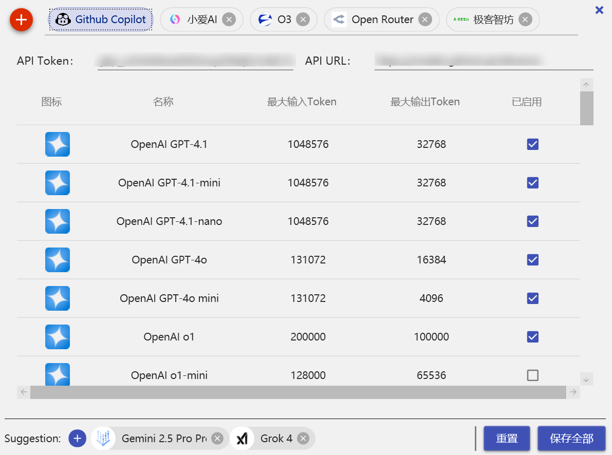
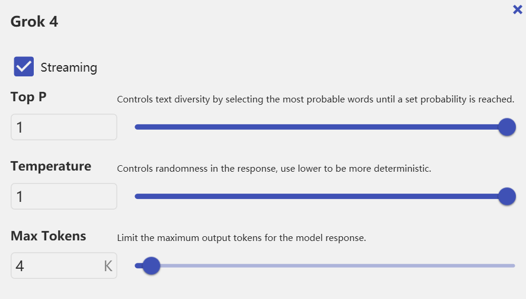
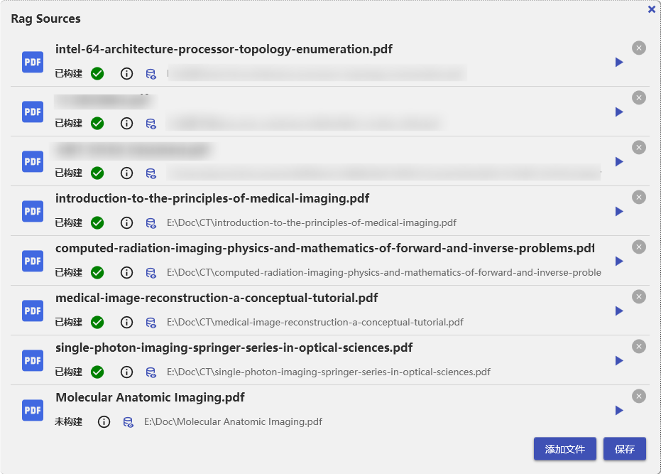
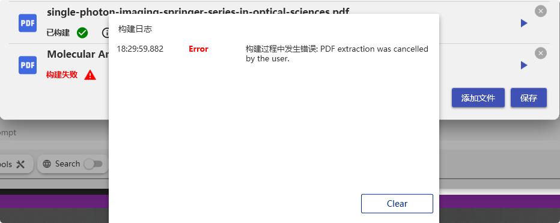
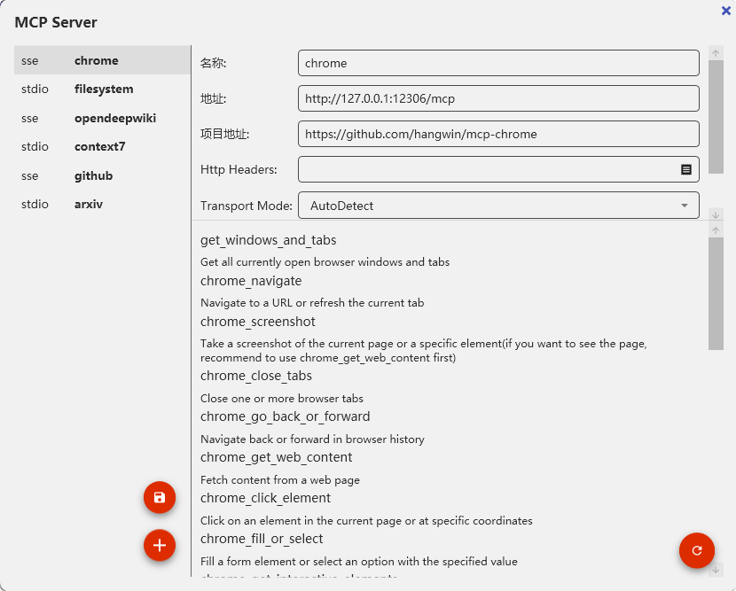

[简体中文](README.md) | [English](README.en-US.md)

# LLM Client for WPF

一个基于 `.NET` 和 `WPF` 技术实现的大语言模型 (LLM) 客户端项目，旨在提供一种轻量级、直观且功能丰富的交互工具，用于使用多种支持的 LLM 服务。本项目默认支持 GitHub Copilot 服务下提供的一些模型（如 `GPT-4o`、`O1` 和 `DeepSeek`），并可通过扩展支持其他服务终结点。

## 纯 .NET WPF 实现
   我想证明，完全使用.Net和经典的WPF构建一个可用的、现代化的LLM客户端是可行的👍。目前的实现大都基于python+ts😢。
   - 使用 `MaterialDesignThemes` 实现现代化界面设计。
   - 利用 `Microsoft.Extensions.AI` 用于集成大语言模型 API。
   - 利用 `Markdig.Wpf` 实现Markdown解析
   - 利用`Microsoft.SemanticKernel`实现核心的大模型对话和RAG能力
   - 利用`pdfpig`实现PDF文档的读取和解析
   - 利用`ModelContextProtocol`实现MCP协议的支持
   - 利用`TextMateSharp`实现语法高亮
   ---
## 基础会话功能
   **终结点-模型配置**
   配置按照终结点进行划分，用户可以添加多个终结点，并为每个终结点添加不同的模型。
   预设有 GitHub Copilot 终结点，用户只需提供 Token 即可使用。
   
   也可以自定义OpenAI API兼容的各种终结点，这里我添加了四个API Endpoints：
   
   上面是最大的模型供应商[openrouter](https://openrouter.com)，可见除了支持手动配置模型外，还可以填写模型id然后从openrouter拉取模型相关信息，方便用户。
   **创建对话**
   在左下角选择''新建对话''，选择终结点和模型，输入问题即可开始对话。
   
   可见每个模型都有自己的特性，不同的特性将拥有不同的功能，比如支持流式输出、支持函数调用等。这些特性也会影响对话的功能可用性。
   **对话界面**
   
   - 精细的对话上下文管理，用户可清空历史、隔离历史、排除单条回复。不同于那些自动管理上下文的工具，用户可以完全控制上下文传递。
   - 支持消息类型区分（如用户消息、模型回复、系统消息等）。
   - 支持对话记录的保存与加载，便于长期使用和管理。
   - 可重发消息
   - 可对比消息（对比时完整支持上下文如函数调用）
   - 可切换模型和调整模型参数
   
   - 可搜索对话，并以黄色高亮显示，可快速定位搜索结果
   - 支持Markdown渲染，支持代码高亮
   - 支持对话导出为Markdown格式，便于存档和分享
   - 支持对话克隆
   - 支持对话备份和导入
   - 支持对话记录的UI虚拟化，提升性能
   - 支持主题切换（暗黑模式和明亮模式）

   - 支持代码高亮主题切换
   **对话功能**
   - 参数更改、模型切换
   - 支持消息重发
   - 支持消息对比
   - 支持语料库搜索并手动选择加入上下文
   - 支持流式输出
   - 支持函数调用（乃至MCP）
   - 支持图片输入（可以直接在输入框黏贴图片）
   - 支持RAG函数（语料库功能被封装为Function，从而最大发挥大模型的灵活性）
   - 支持搜索参数（不同API供应商会有不同的附加参数，如OpenRouter）
   - 支持搜索工具（Function Call）
   - 支持Thinking开关（OpenRouter）
----

## 精细RAG
Retrieval-Augmented Generation 指的是通过检索相关信息来增强生成式模型的回答能力。在本项目中，RAG 功能允许用户将外部知识库（如文档、网页等）与大语言模型结合使用，以提供更准确和上下文相关的回答。不同于普通的RAG，本项目的RAG功能具三大特点：
1. **精细化文件导入**：我们知道RAG瓶颈在于文档的预处理，在这个阶段可能丢失大量信息。本项目支持多种文件格式（如PDF、Word、文本文件等）的导入，并提供细粒度的分块和嵌入选项，确保最大限度地保留文档内容的完整性。
2. **函数调用集成**：RAG 功能被封装为函数调用，不仅仅有Query，还有文档结构查询等功能，让LLM在理解文档概览的前提下生成Query字符串。这样可以充分利用大模型的推理能力，动态决定何时调用RAG功能，从而提升回答的相关性和准确性。
3. **结构化查询**：文件不会被直接切分为扁平块，而是会被解析为结构化数据（如章节、段落等），每个节点自动生成Summary，从而支持更复杂的查询策略。查询过程会基于结构的特性，选择性地执行自顶向下或自底向上的检索策略。查询结果也会以结构化的形式返回，便于大模型理解和使用。比如，返回的某个段落将包含他的章节信息，方便模型理解上下文。

**文件导入**
用户可以通过UI界面导入文件，支持多种格式（目前只支持PDF、Markdown）。文件的管理页面如下：

选择文件后，通过右侧的开关按钮可以开始实施导入。一般来说，RAG在第一步**文件的结构化**遭遇信息损失，为了实现对RAG过程的高度可控，文件的导入过程提供了额外控制。比如下面的PDF，可以在界面中选择Margin，预览和更改Bookmark（有些PDF的Bookmark标记错误）。

上图表示依据Bookmark被划分的节点,下一步会生成Summary，最终文件会被Embedding后存入矢量数据库（本地Sqlite），最终我们可以预览他们：

如上图，数据以树形结构显示，对于Bookmark节点，显示其Summary，对于Paragraph/Page节点，显示实际内容。
如果构建失败，可以在日志查看原因：

## MCP 支持
-  支持UI和Json方式添加工具 
-  Json方式的格式和Claude Code等工具类似

- 添加后可以手动刷新，获取工具列表

- MCP工具还可以附带一个Prompt，当选择该工具时会自动附加到System Prompt

## Project（Experimental）
项目功能允许用户创建和管理多个相关对话，他们共享同一个上下文，适用于需要跨多个对话进行协作或跟踪不同主题的场景。每个项目可以包含多个对话，并且可以方便地在项目之间切换和管理。

## 待完成特性

以下功能正在计划开发中：

1. **编排预设 CoT**
   - 支持编排基于 Chain-of-Thought (CoT) 的推理过程，帮助用户更高效地获得多步推理输出。

2. **Auto-CoT**
   - 自动生成 Chain-of-Thought 推理，提升复杂任务的自动化处理效果。

3. **自动上下文管理**
   - 提供上下文的智能管理功能，无需手动排除历史记录。
## 如何参与项目

本项目尚在开发阶段，您可以通过以下方式参与：

1. 提交 Issue 或 PR：任何关于功能反馈、Bug 修复或者新特性的建议都非常欢迎！
2. 成为贡献者：直接 Fork 本项目，并发起 Pull Request。
3. 联系作者：如果有任何问题或者合作意向，可以通过 [GitHub Issues](https://github.com/) 联系我。

---

这是一个学习性质的项目，请不吝赐教！
